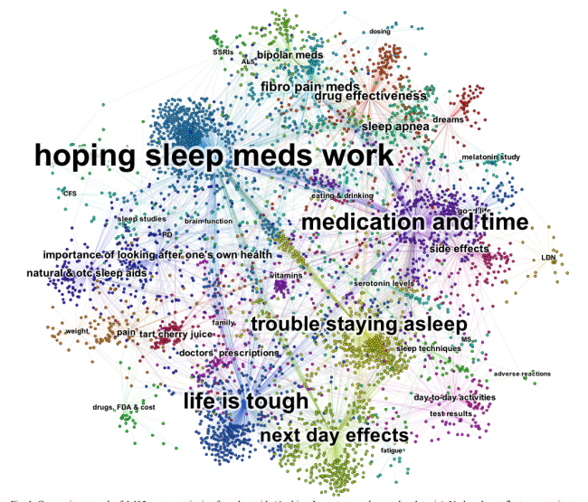

# Data Visualization Proposal

A 'topic model network graph' of all of the articles pulled from our 27 sources that will allow users to visualize their network of sources and how it fits into the larger ecosystem of news.

## Network Graphs / Models

##### **Note: The content of this topic model is COMPLETELY COINCIDENTAL--it just happened to be the first example of topic modeling network graphs that returned in a search ¯\\_(ツ)_/¯**

The app component would:

1.  crawl each day's 'top headlines' from Burst's 27 sources in NewsApi.org's 'sources' endpoint
2.  generate the topic models server-side (Java/Google Topic Modeling Tool)
3.  use d3 to generate an interactive network graph of article links (nodes) clustered by (manually-labeled or unlabeled) topics, colored by poliori, weighted by % of words devoted to each topic
4.  stretch goal: highlight articles from user sources
5.  stretch goal: provide a recommended list of articles that transverse the network to take them to the other side
6.  bonus: bubbles!

## Proof of Concept Roadmap

[Network Graph in d3](https://bl.ocks.org/mbostock/aba1a8d1a484f5c5f294eebd353842da): a demo of a network graph with adjustable strength.

[Simple interactive network graph](http://bl.ocks.org/jose187/4733747)

[Interactive Force Graph demo](https://uber.github.io/react-vis-force/?selectedKind=%3CInteractiveForceGraph%20%2F%3E&selectedStory=10%20nodes&full=0&down=1&left=1&panelRight=0&downPanel=kadirahq%2Fstorybook-addon-actions%2Factions-panel)

[(repo)](https://uber.github.io/react-vis-force/)

[How (conceptually) to use React with d3](https://d4.js.org/) (could use help with this step to make it go quickly)

[Google Topic Modeling Tool](https://code.google.com/archive/p/topic-modeling-tool/downloads)
a Java app that generates topic models from a corpus of words and outputs them in an organized data format. Takes a csv of text documents and outputs a very organized fileset (see ted_talks_example html file)

Using Java on Heroku (if that's where we deploy) seems straightforward but maybe bloated?

## Feasibility

1.  this is reasonable, I could most likely write it in 4 hours but already have some news datasets to practice with and could DEFINITELY polish it by demo-day
2.  this is basically already done if Java can be run server-side
3.  there are some good examples online but some of the libraries are a tad outdated, and this process would probably need to be converted to React principles. So seems feasible but could have unforseen obstacles
4.  seems like it should be easy
5.  not sure about this one, I've collaborated on a similar function in Python for another source of data but it'd be a stretch
6.  bubbles!

## Other Ideas

http://dataviz.tools/category/network-visualization/
Several tools that look promising, including Alchemy.js (written in d3)

http://graphalchemist.github.io/Alchemy/#/examples
GraphAlchemist (same as Alchemy.js, but all over the place)

https://qz.com/896000/a-complete-guide-to-seeing-beyond-your-cozy-filter-bubble/

https://public.tableau.com/en-us/s/
Tableau is very polished and manageable to use, but imo a little boring/buzz-wordy
